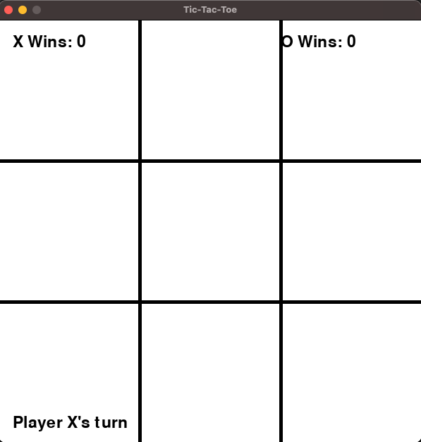
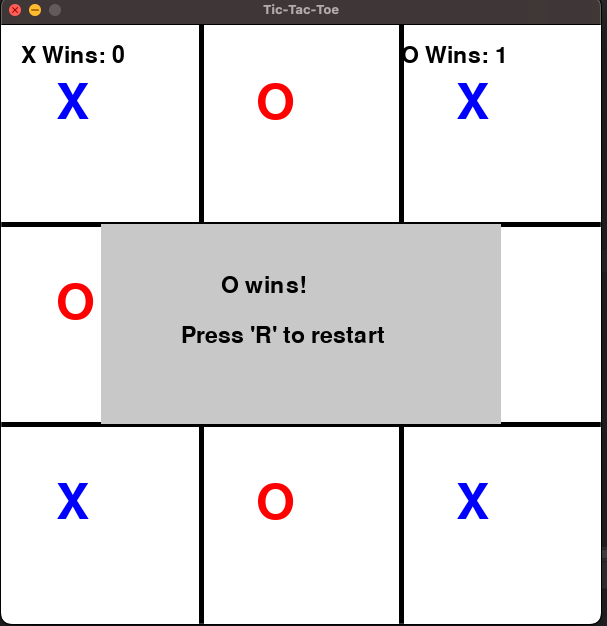
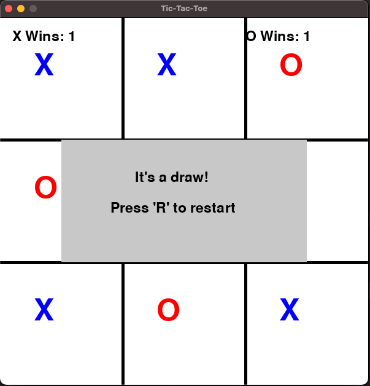

# Tic-Tac-Toe Game

This is a simple Tic-Tac-Toe game built using Pygame. The game allows two players to take turns and place their symbols ('X' and 'O') on a 3x3 grid. The game checks for win conditions and keeps track of the number of wins for each player. When a game ends, a popup message displays the winner and prompts the players to restart the game.

## Table of Contents

- [Features](#features)
- [Requirements](#requirements)
- [Installation](#installation)
- [Usage](#usage)
- [Gameplay](#gameplay)


## Game Screens

Normal game screen:



Winner screen:



Draw screen:



## Features

- Player vs Player gameplay
- Mouse input for placing symbols
- Popup message displaying the winner and a prompt to restart
- Win counters for both 'X' and 'O'

## Requirements

- Python 3.6 or later
- Pygame library

## Installation

1. **Clone the repository**:
    ```sh
    git clone https://github.com/yourusername/tic-tac-toe.git
    cd tic-tac-toe
    ```

2. **Set up a virtual environment**:
    ```sh
    python -m venv venv
    ```

3. **Activate the virtual environment**:
    - On Windows:
        ```sh
        venv\Scripts\activate
        ```
    - On macOS and Linux:
        ```sh
        source venv/bin/activate
        ```

4. **Install the required dependencies**:
    ```sh
    pip install -r requirements.txt
    ```

## Usage

1. **Run the game**:
    ```sh
    python tic_tac_toe.py
    ```

2. **Playing the game**:
    - Use the mouse to click on the grid and place your symbol ('X' or 'O').
    - The game alternates between players automatically.
    - When a game ends, a popup message will display the winner and prompt you to press 'R' to restart the game.
    - The win counters for 'X' and 'O' are displayed at the top of the screen.

## Gameplay

- The game board consists of a 3x3 grid.
- Two players take turns to place their symbols ('X' and 'O') on the board.
- The game checks for a win condition (three consecutive symbols in a row, column, or diagonal) or a draw (all grid cells filled without a winner).
- A popup message displays the winner and prompts the players to press 'R' to restart the game.
- The win counters for each player are updated and displayed at the top of the screen.

